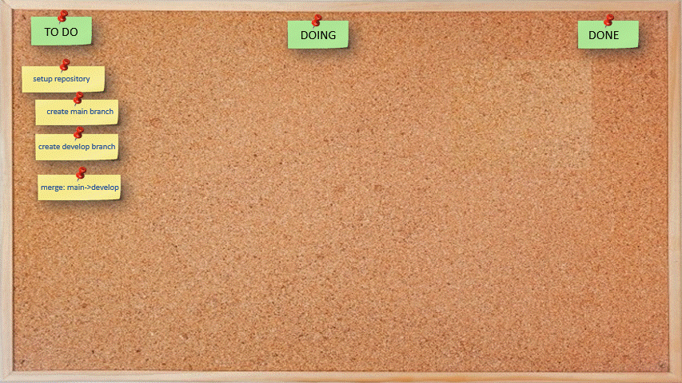

# Agile/Repository/Setup  

<h3 align="center">Setup</h3>

- - -

- - -

|     |     |     |
| --- | --- | --- |
| 1. [top](#Setup) | 2. [main page](/README.md) | 3. [download](./A1_setup.pptx) |
|     |     |     |
