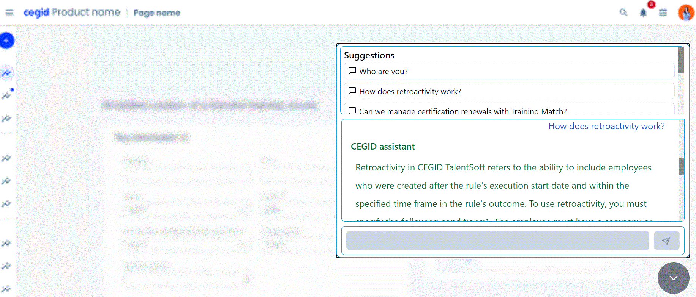

# Hackathon/Client  

<h3 align="center">Client</h3>

- - -

1. Svelt APP  
    1. [Open](http://1010836-chat.000.pe)  
    2. UI  
  
    3. Uses rollup to generate a simple script    
    
    4. This script can be added to any web app    
     
2. Implementation  
    1. When a question is prompted  
        1. Access COLAB API with the question  
    

- - -

|     |     |
| --- | --- |
| 1. [top](#Client) | 2. [main page](/README.md) |
|     |     |

