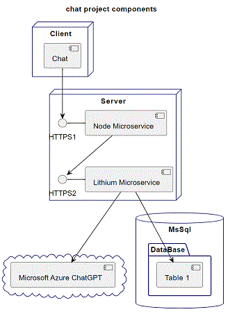

# Contasimple  

<h3 align="center">Contasimple</h3>

- - -

1. [Server](./server/README.md)
2. [Client](./client/README.md)

- - -

|     |     |
| --- | --- |
| 1. [top](#Contasimple) | 2. [main page](/README.md) |
|     |     |