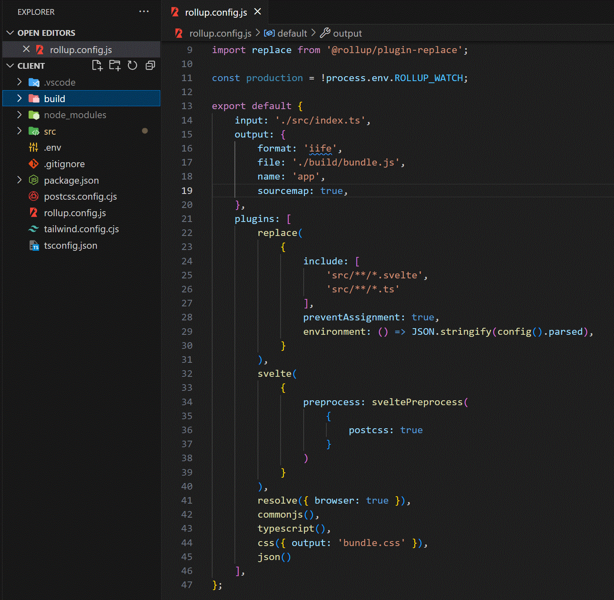
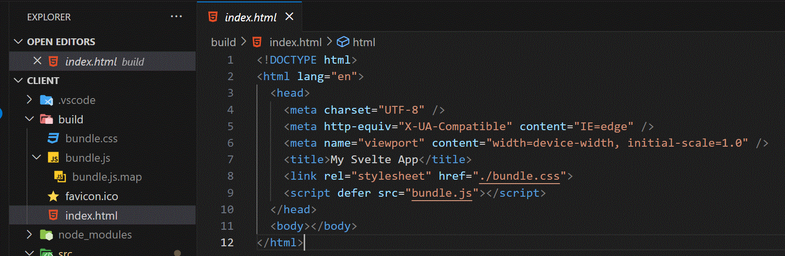
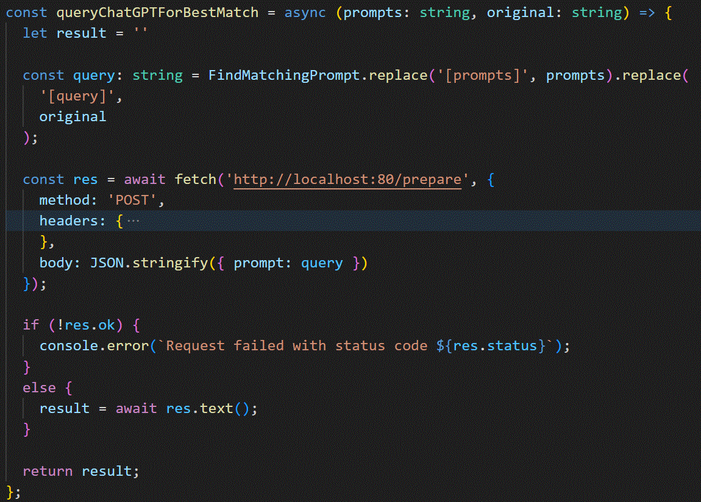
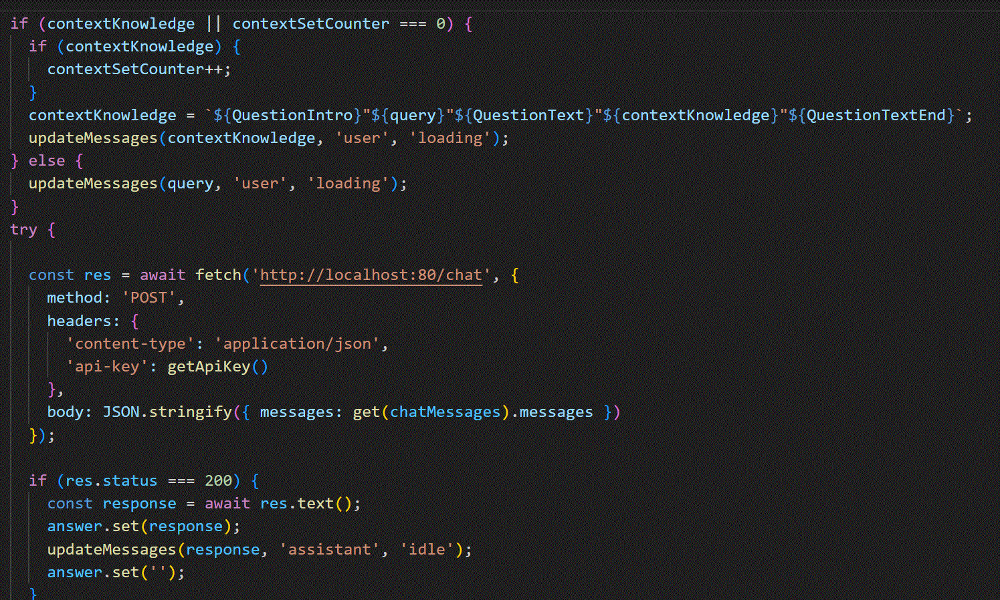

# Contasimple/Client  

<h3 align="center">Client</h3>

- - -

1. Svelt APP
    1. Uses rollup to generate a simple script. 
    
    2. This script can be added to any web app.
    
2. Implementation
    1. When a question is prompted
        1. Queries CHATGPT for the best related question in our embeddings data.
    
        2. POSTS the question to CHATGPT and updates conversation history.
    

- - -

|     |     |
| --- | --- |
| 1. [top](#Client) | 2. [main page](/README.md) |
|     |     |

