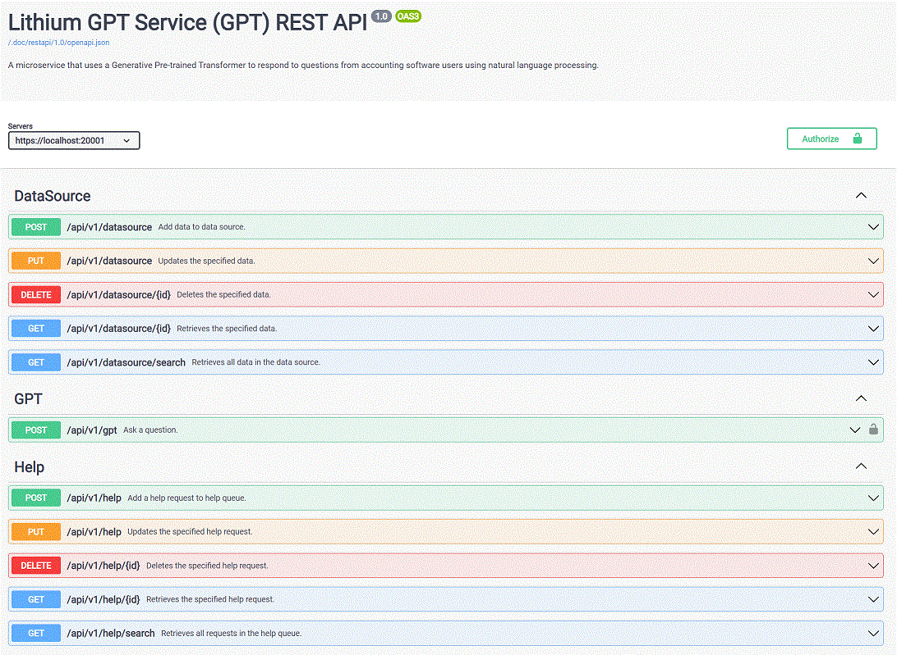
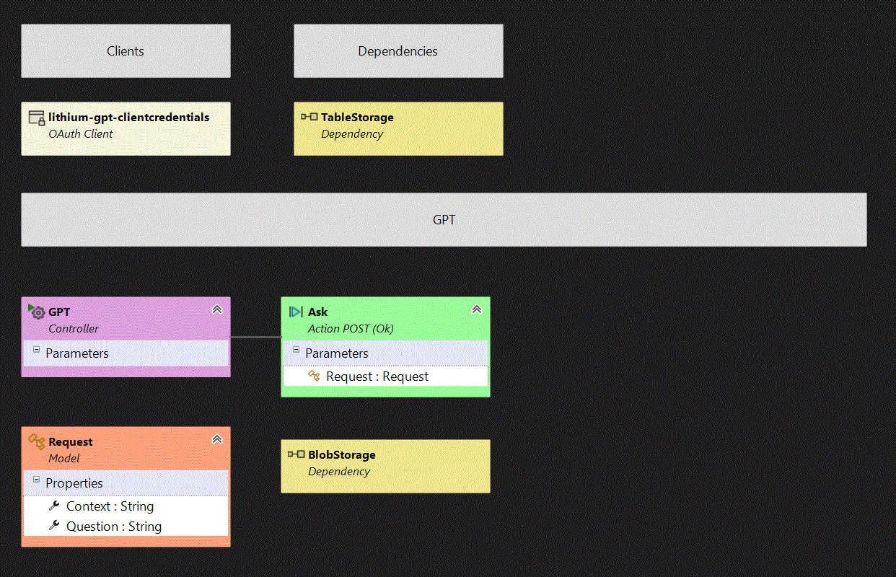
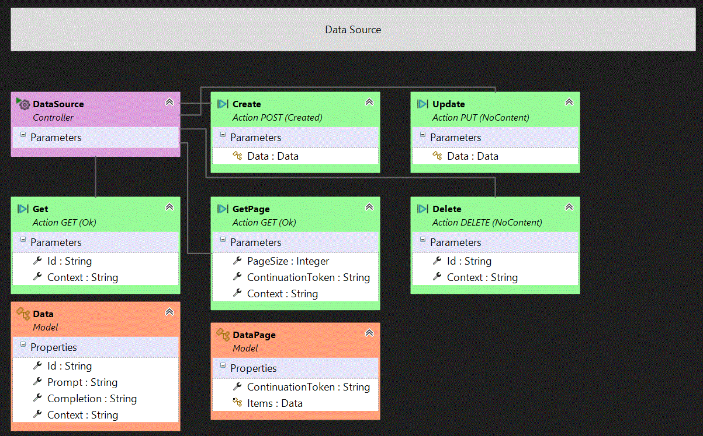
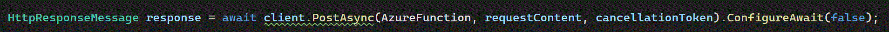
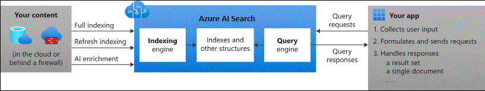

# Contasimple/Server  

<h3 align="center">Server</h3>

- - -

1. Lithium Microservice
    1. Manages all requests to CHATGPT and the conversation history.
    
2. Implementation
    1. Lithium class diagram

    2. Data source
    
    3. CHATGPT access
 
        1.	The Azure Function is hosted on the Azure platform, specifically on the "lithium-dv-ana-af" Azure App Service.
        2.	The Azure Function is triggered by an HTTP POST request to the specified endpoint: "https://lithium-dv-ana-af.azurewebsites.net/api/gpt_ask".
        3.	The Azure Function receives the POST request and extracts the request body, which is expected to be in JSON format.
        4.	The request body contains two properties: "kbid" and "question". These properties are used to provide context and the actual question to the Azure Function.
        5.	The Azure Function processes the request, performs any necessary operations, and generates a response.
        6.	The response is then returned from the Azure Function to the caller of the POST request.
    4. Embeddings
 
        
- - -

|     |     |
| --- | --- |
| 1. [top](#Server) | 2. [main page](/README.md) |
|     |     |

