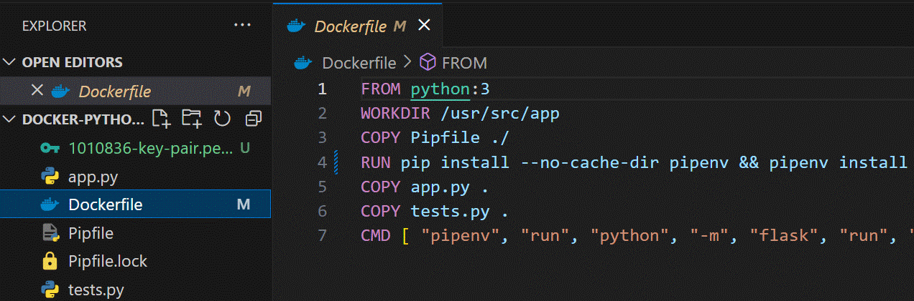
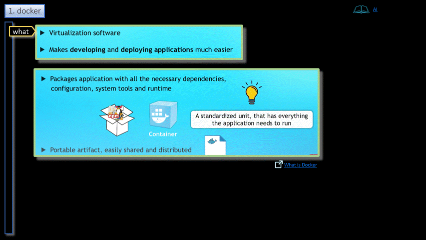

# Docker  

<h3 align="center">Docker</h3>

- - -

1. [Run](http://51.20.133.14)
2. [Project](./_projects/keyValuePair)
    - Key-Value-Pair REST API used in the project hackathon   
    - Runs in a container inside AWS   

- - -

1. [Local](./local/README.md)
2. [AWS](./aws/README.md)

- - -

1. Docker
2. Process
    1. Standard
    2. Containers
3. How it works
4. Advantages
5. Disadvantages

- - -

|     |     |     |
| --- | --- | --- |
| 1. [top](#Docker) | 2. [main page](/README.md) | 3. [download](./docker.pptx) |
|     |     |     |
