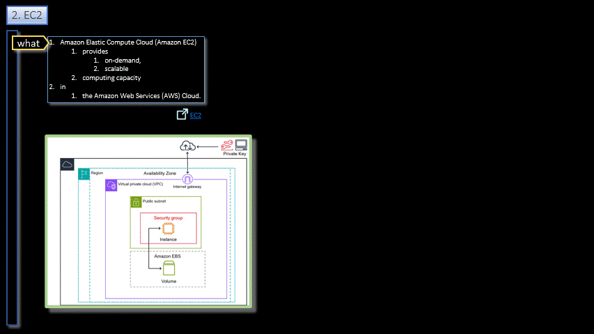

# Docker/AWS  

<h3 align="center">AWS</h3>

- - -

1. EC2
    1. Launch
    2. Setup
        1. Network
        2. Storage
    3. Start
    4. Connect
        1. Login
    5. Console    
2. Docker
    1. Upload
    2. Build
    3. Run

- - -

|     |     |     |
| --- | --- | --- |
| 1. [top](#AWS) | 2. [main page](/README.md) | 3. [download](./docker_aws.gif.pptx) |
|     |     |     |
