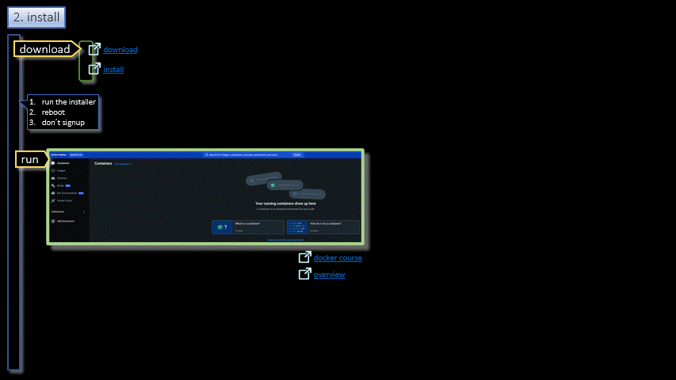

# Docker/Local  

<h3 align="center">Local</h3>

- - -

1. Install
2. Tutorial
3. Environment
4. PipFile
5. Code
6. Docker
7. Build
8. Run

- - -

|     |     |
| --- | --- |
| 1. [top](#Local) | 2. [main page](/README.md) | 3. [download](./docker_local.pptx) |
|     |     |
