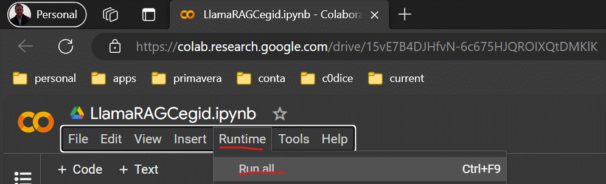
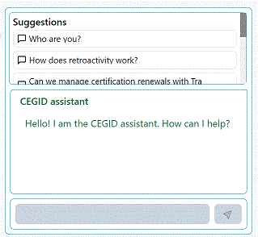

# Hackathon  

<h3 align="center">Hackathon</h3>

- - -

1. [Server](./server/README.md)
2. [Client](./client/README.md)
3. [Video](https://www.youtube.com/watch?v=OhMexqtfJGI)
4. Run  
    4.1 [Open google colab](https://colab.research.google.com/drive/15vE7B4DJHfvN-6c675HJQROIXQtDMKlK)  

    |       |     |     |     | 
    | ----- | --- | --- | --- |
    | 4.1.1 | Runtime -> Run All        |     |    |
    |       |   |     |    |
    |       |     |     |     |

    |       |     |     |     | 
    | ----- | --- | --- | --- |
    | 4.1.2 |  **Wait until it finishes**        |     |    |
    |       |   |     |    |
    |       |     |     |     |

    
    4.2 [Open client](http://1010836-chat.000.pe)  

    |       |     |     |     | 
    | ----- | --- | --- | --- |
    | 4.2.1 |  Click in the bottom/right to open chat |     |    |
    |       |           |     |    |
    |       |     |     |     |
        
    |       |     |     |     | 
    | ----- | --- | --- | --- |
    | 4.2.2 |  Choose a question from suggestions or Type a question |     |    |
    |       |               |     |    |
    |       |     |     |     |

    |       |     |     |     | 
    | ----- | --- | --- | --- |
    | 4.2.3 |  **Wait for the answer**          |     |    |
    |       |  |     |    |
    |       |     |     |     |

- - -

|     |     |
| --- | --- |
| 1. [top](#Hackathon) | 2. [main page](/README.md) |
|     |     |