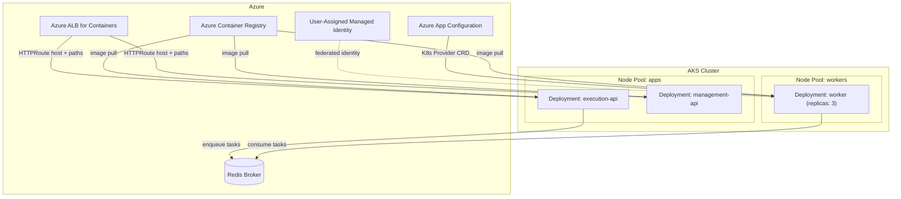
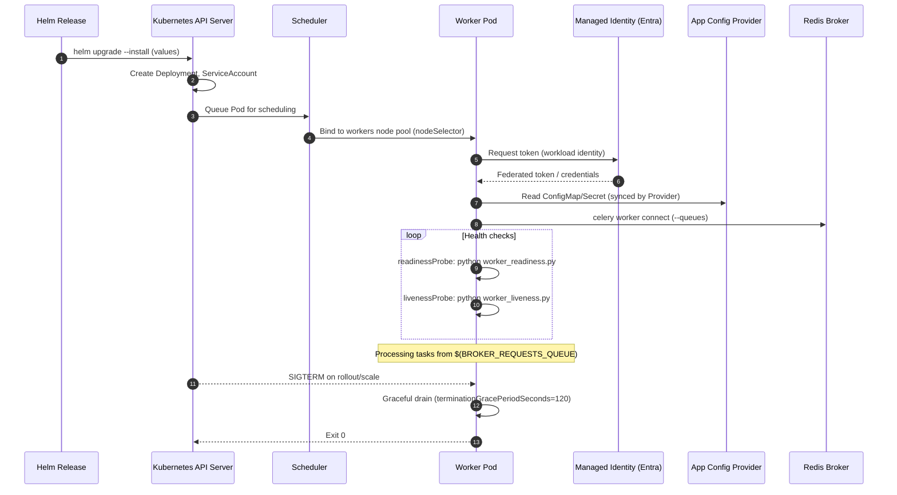

# Pulse‑OS Workers on Kubernetes — Deep Dive & Tutorial

This guide focuses exclusively on the Celery workers and every related Kubernetes/Helm concept in this chart. It includes visuals, a step‑by‑step tutorial to recreate the setup from scratch, and tooling tips.

---

## Visual Overview



---

## What the chart deploys for workers

- Deployment: see [.ci-cd/infrastructure/kubernetes/templates/workers-deployment.yaml](.ci-cd/infrastructure/kubernetes/templates/workers-deployment.yaml)
  - Namespace: `.Values.workers.namespace` (default `workers-blue`).
  - Scheduling: `nodeSelector: kubernetes.azure.com/agentpool: workers` to target the workers node pool.
  - Identity: `serviceAccountName: sa-workers-workloadidentity` and pod label `azure.workload.identity/use: "true"` for Microsoft Entra Workload Identity.
  - Command: `celery -A main_worker worker -P prefork -Q $(BROKER_REQUESTS_QUEUE) --events -n worker1@%h` (prefork pool, named worker, using queue from env).
  - Health probes: `readinessProbe` and `livenessProbe` run Python scripts (`worker_readiness.py`, `worker_liveness.py`).
  - Env & secrets: `envFrom` consumes `configmap-api-workers` and `secret-api-workers` (you must create/populate them).
  - Resources: requests/limits sized for memory‑intensive tasks (adjust as needed).
  - Graceful shutdown: `terminationGracePeriodSeconds: 120` for task drain.
  - Optional Spot: tolerations/affinity gated by `.Values.workers.spot.enabled`.

- App Configuration (optional but present): [.ci-cd/infrastructure/kubernetes/templates/custom-engine-configuration-provider.yaml](.ci-cd/infrastructure/kubernetes/templates/custom-engine-configuration-provider.yaml)
  - CRD `azconfig.io/v1` syncs keys (label `custom-engine-workers`) to `configmap-custom-engine-workers` and `secret-custom-engine-workers` using the workers ServiceAccount via Workload Identity.

---

## Worker Pod lifecycle (at a glance)



---

## Step‑by‑Step: Recreate the workers from scratch

1) Prerequisites
- AKS with Workload Identity enabled and OIDC issuer configured.
- Azure ALB for Containers and Gateway API installed (cluster‑level, handled by platform; workers do not need an Ingress directly).
- Azure App Configuration Kubernetes Provider CRD installed, if you intend to sync configuration.
- Redis broker reachable from the cluster (Azure Cache for Redis or self‑managed).

2) Namespaces and ServiceAccount
```bash
kubectl create namespace workers-blue
kubectl -n workers-blue create serviceaccount sa-workers-workloadidentity
```
- Create a federated identity credential mapping `sa-workers-workloadidentity` to a user‑assigned managed identity in Entra ID (see AKS docs for `az identity federated-credential create`).

3) Configuration data
- Create the base ConfigMap/Secret referenced by the worker Deployment:
```bash
kubectl -n workers-blue create configmap configmap-api-workers \
  --from-literal=BROKER_URL=redis://<host>:6379/0 \
  --from-literal=BROKER_REQUESTS_QUEUE=requests

kubectl -n workers-blue create secret generic secret-api-workers \
  --from-literal=APP_SECRET_KEY=<redacted>
```
- If using Azure App Configuration Provider, deploy the CRD instance to sync additional keys (already modeled in the chart at [.ci-cd/infrastructure/kubernetes/templates/custom-engine-configuration-provider.yaml](.ci-cd/infrastructure/kubernetes/templates/custom-engine-configuration-provider.yaml)). Ensure `.Values.app_configuration.endpoint` is set.

4) Set chart values and deploy workers
- Minimal values (plus your registry and tag):
```bash
helm upgrade --install pulse-os-api \
  .ci-cd/infrastructure/kubernetes \
  --namespace workers-blue \
  --set azure_container_registry.endpoint="<registry>.azurecr.io" \
  --set azure_container_registry.image="pulseos" \
  --set version="<image-tag>" \
  --set workers.namespace="workers-blue" \
  --set app_configuration.endpoint="https://<appconfig>.azconfig.io"
```
- The chart deploys APIs and workers together; the `workers.namespace` value ensures the worker Deployment lands in the right namespace.

5) Verify scheduling, identity, and broker connectivity
```bash
kubectl -n workers-blue get pods -l component=worker -o wide
kubectl -n workers-blue describe pod <worker-pod>
kubectl -n workers-blue logs <worker-pod>
```
- Look for Celery startup lines and successful connection to the broker.
- Confirm node assignment shows the workers pool.

6) Health probes and readiness
- Readiness runs `python /cegid-pulse-os/worker_readiness.py`.
- Liveness runs `python /cegid-pulse-os/worker_liveness.py`.
- If readiness flaps, check broker DNS, secrets/env values, and identity permissions if external services are involved.

7) Scaling and draining
```bash
# Scale replicas
kubectl -n workers-blue scale deploy/worker --replicas=5

# Observe graceful termination on rollout
helm upgrade pulse-os-api .ci-cd/infrastructure/kubernetes --namespace workers-blue --set version="<new-tag>"
```
- The 120s termination grace lets in‑flight tasks finish; tune Celery acks and time limits based on workload.

8) Optional: Spot nodes
- Enable in values: `workers.spot.enabled: true` to add tolerations/affinity targeting spot VMs.
- Validate your AKS node pool labels match the expected `kubernetes.azure.com/scalesetpriority=spot`.

---

## Worker anatomy (key spec elements)

- Container command
  - `celery -A main_worker worker -P prefork -Q $(BROKER_REQUESTS_QUEUE) --events -n worker1@%h`
  - Tune `--concurrency`, `--max-tasks-per-child`, and `--time-limit` as needed.

- Identity & configuration
  - `serviceAccountName: sa-workers-workloadidentity` and pod label `azure.workload.identity/use: "true"` enable Workload Identity.
  - `envFrom` pulls shared settings/secrets. If Azure App Config Provider syncs extra keys to dedicated ConfigMap/Secret, you can add those via another `envFrom` or `env` entries.

- Scheduling & resilience
  - `nodeSelector` anchors pods to the workers pool.
  - Optional spot tolerations/affinity when enabled.
  - Consider adding a PodDisruptionBudget and topology spread constraints for higher resilience.

- Resources & probes
  - Requests/limits pre‑sized; monitor and right‑size based on task mix.
  - Exec probes keep the worker healthy without exposing HTTP ports.

---

## Operating & Troubleshooting

- Common checks
```bash
kubectl -n workers-blue get events --sort-by=.lastTimestamp
kubectl -n workers-blue logs deploy/worker --tail=200
kubectl -n workers-blue describe deploy/worker
```

- Frequent issues and fixes
  - Broker unreachable: verify `BROKER_URL` and network egress; test from a debug pod.
  - Identity errors: ensure federated credential binds the ServiceAccount; verify `azure.workload.identity/use` label.
  - Readiness failing: confirm Redis connectivity and that probe scripts are present in the image.
  - Premature kill: increase `terminationGracePeriodSeconds` or tune Celery acks/timelimits.

---

## Visual tooling & VS Code extensions

- Helm authoring
  - Microsoft Helm extension: enables chart syntax, template rendering, and linting (ID: `ms-kubernetes-tools.vscode-helm`).
  - YAML by Red Hat: schema validation and authoring support (ID: `redhat.vscode-yaml`).
  - Helm Dashboard: visual UI for releases and values (ID: `komodorio.helm-dashboard`).

- Kubernetes operations
  - Kubernetes extension for VS Code (ID: `ms-kubernetes-tools.vscode-kubernetes-tools`): browse resources, apply manifests, view logs.
  - Lens / OpenLens (desktop): graphical Kubernetes explorer for workloads, events, and logs.

- Diagramming
  - Mermaid support (VS Code built‑in preview or extensions) to maintain living architecture diagrams in markdown.

- Can I use visual tools to create Helm charts?
  - There’s no fully graphical “drag‑and‑drop” chart designer that’s widely adopted; however, Helm Dashboard plus the VS Code Helm/YAML extensions provide strong visual assistance for authoring, linting, rendering (`helm template`), and managing releases.

---

## Appendix: Values relevant to workers

- [.ci-cd/infrastructure/kubernetes/values.yaml](.ci-cd/infrastructure/kubernetes/values.yaml)
  - `workers.namespace`: namespace to deploy workers (default `workers-blue`).
  - `workers.spot.enabled`: add tolerations/affinity for spot nodes.
  - `azure_container_registry.endpoint`, `azure_container_registry.image`, `version`: image reference used by the workers Deployment.
  - `app_configuration.endpoint`: endpoint for the Azure App Configuration Provider.

If you want, I can extend this chart with a sample HPA/KEDA for workers, add a `_helpers.tpl`, and surface worker‑specific settings (concurrency, queues, probes) in `values.yaml` for easier tuning.