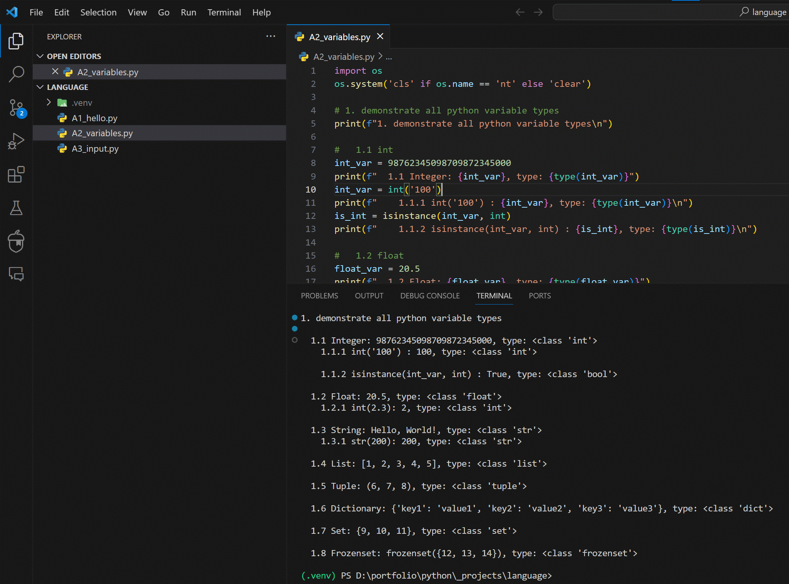
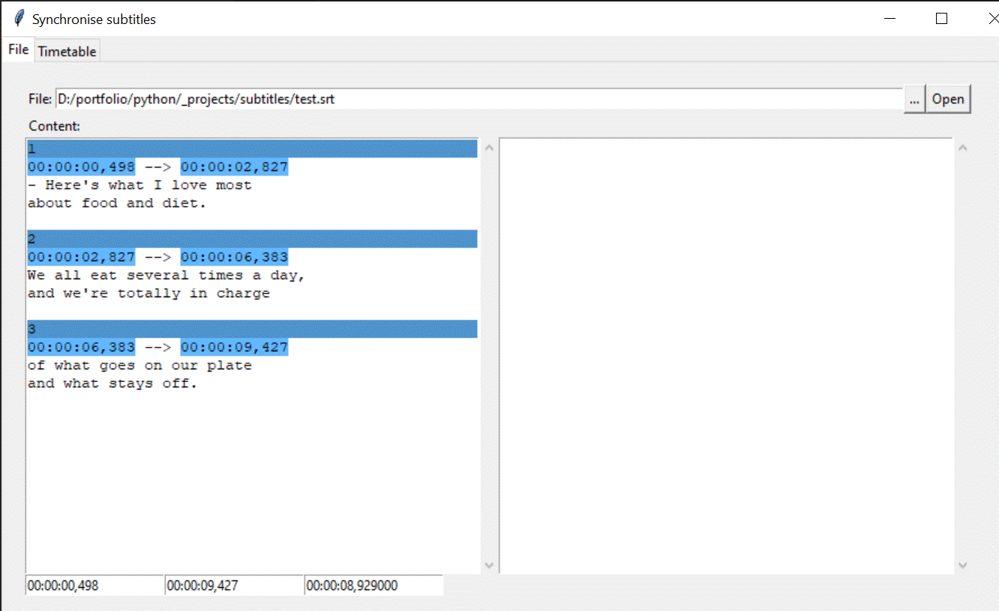
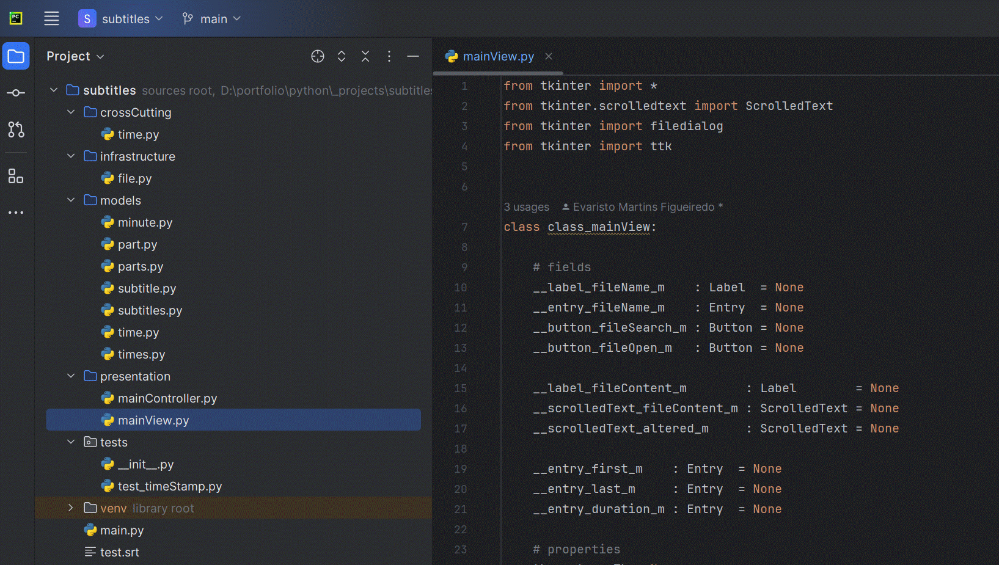

### Python/Projects  

<h3 align="center">Projects</h3>

- - -

1. [Language](./language/A2_variables.py)
    - Simple console APP to demonstrate the use of the most basic functionalities of the language.
    - Demonstration of the VsCode IDE configured for Python.

2. [Subtitles](./subtitles/main.py)
    - Desktop APP to demonstrate the use of advanced functionalities of the language.
    - Demonstration of the Idea IDE configured for Python.

- - -

 

|     |     |
| --- | --- |
| 1. [top](#Projects) | 2. [main page](/README.md) |
|     |     |

