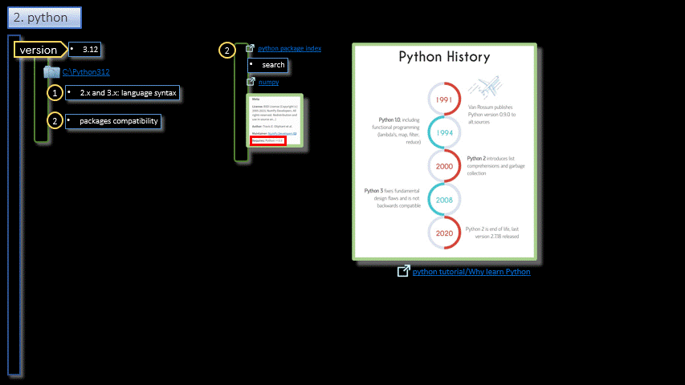

# Python  

## Environment

1. Interpreter
2. VsCode
    1. Extensions
3. Env
4. Hello World
5. Run
6. Debug
7. Packages
8. Next
7. REPL

- - -
|     |     |     |
| --- | --- | --- |
| 1. [top](#python) | 2. [main page](/README.md) | [3. download](./assets/environment.pptx) |
|     |     |     |
- - -

