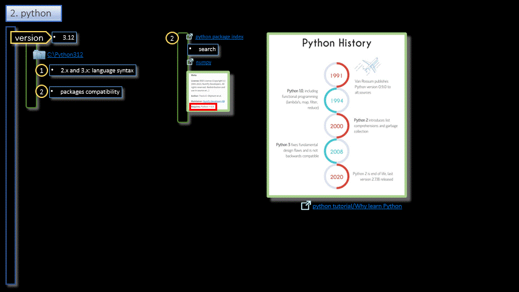

### Python/Environment  

<h3 align="center"> Environment</h3>

- - -

1. Interpreter
2. VsCode
    1. Extensions
3. Env
4. Hello World
5. Run
6. Debug
7. Packages
8. Next
7. REPL

- - -

 

|     |     |     |
| --- | --- | --- |
| 1. [top](#Environment) | 2. [main page](/README.md) | 3. [download](./environment.pptx) |
|     |     |     |

