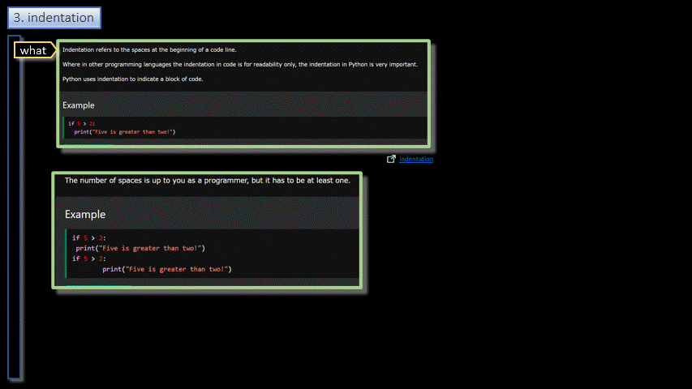

### Python/Language  

<h3 align="center">Language</h3>

- - -

|     |     | 
| --- | --- | 
| 1. Indentation        | 6.  [Variables](./variables/README.md) |
| 2. Comments           | 7.  [Loops](./loops/README.md)         |
| 3. Types              | 8.  [Arrays](./arrays/README.md)       |
| 4. Build in functions | 9.  [Functions](./functions/README.md) |
|   4.1 Print           | 10. [OOP](./oop/README.md)             |
|   4.2 Input           | 11. [Structure](./structure/README.md)              |
|   4.3 Dir             |  |
| 5. Reserved           |  |
|   5.1 None            |  |
|   5.2 Pass            |  |
|     |     |

- - -

 

|     |     |     |
| --- | --- | --- |
| 1. [top](#Language) | 2. [main page](/README.md) | 3. [download](./language.pptx) |
|     |     |     |

