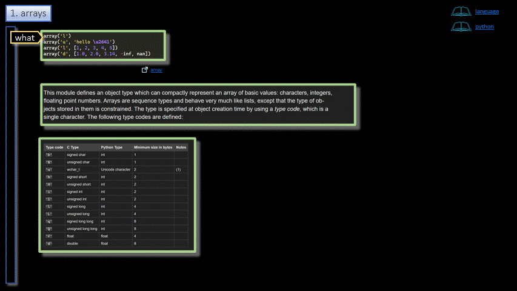

# Python/Language/Arrays  

<h3 align="center">Arrays</h3>

- - -

1. Arrays

- - -

 

|     |     |     |
| --- | --- | --- |
| 1. [top](#Arrays) | 2. [main page](/README.md) | 3. [download](./arrays.pptx) |
|     |     |     |

