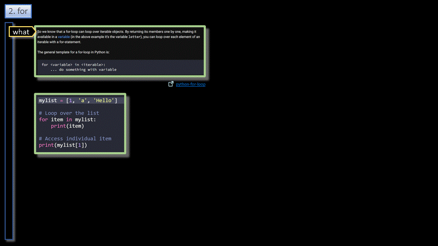

# Python/Language/Loops  

<h3 align="center">Loops</h3>

- - -

1. For
2. While

- - -

 

|     |     |     |
| --- | --- | --- |
| 1. [top](#Loops) | 2. [main page](/README.md) | 3. [download](./variables.pptx) |
|     |     |     |

