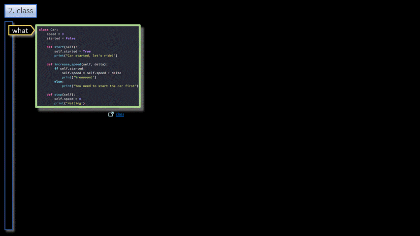

# Python/Language/OOP  

<h3 align="center">OOP</h3>

- - -

1. Class
2. Object
3. Self
4. Constructor
5. Inheritance
6. Data class

- - -

 

|     |     |     |
| --- | --- | --- |
| 1. [top](#OOP) | 2. [main page](/README.md) | 3. [download](./oop.pptx) |
|     |     |     |

