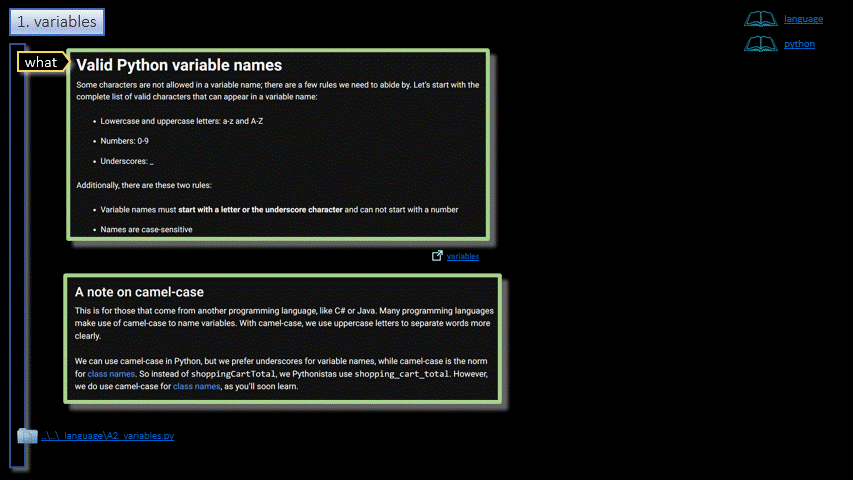

# Python/Language/Variables  

<h3 align="center">Variables</h3>

- - -

1. Variables
2. Types
    1. Integer
        1. Operators
    2. Strings
    3. Boolean

- - -

 

|     |     |     |
| --- | --- | --- |
| 1. [top](#Variables) | 2. [main page](/README.md) | 3. [download](./variables.pptx) |
|     |     |     |

