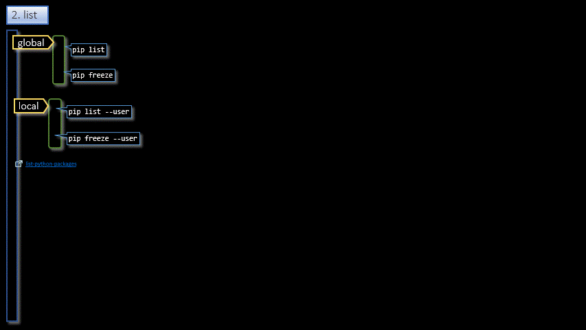

# Python/PIP  

<h3 align="center">PIP</h3>

- - -

1. List

- - -

 

|     |     |     |
| --- | --- | --- |
| 1. [top](#PIP) | 2. [main page](/README.md) | 3. [download](./pip.pptx) |
|     |     |     |

